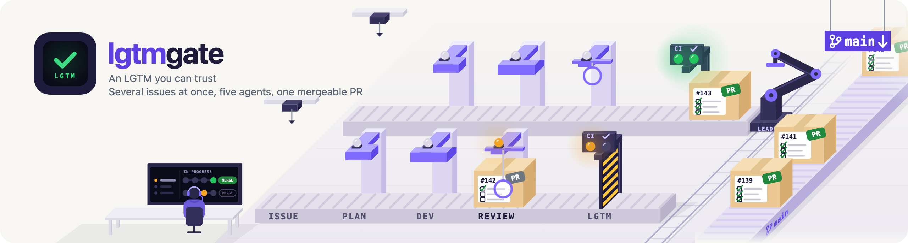
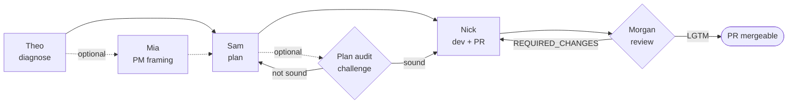

<picture>
  <source media="(prefers-reduced-motion: reduce)" srcset=".github/assets/header-static.png">
  <source media="(prefers-color-scheme: dark)" srcset=".github/assets/header-dark.svg">
  <source srcset=".github/assets/header.svg">
  
</picture>

[](LICENSE)
[](https://code.claude.com/docs/en/plugins)
[](#engineering-highlights)

lgtmgate is a Claude Code plugin that takes a GitHub issue through to a merge-ready pull request. A diagnosis agent checks the issue is real before anyone writes a plan for it. A reviewer checks each item on the acceptance checklist against actual evidence, a command's output or an artifact, before approving. None of the agents merge anything themselves, including when this repo ships its own releases.

## How it works



Theo reproduces the reported problem before anyone touches code. Mia frames the feature in product terms, but only if asked. Sam writes the plan, anchored to files it actually read this run. Nick implements the plan and opens the PR. Morgan, a different agent than the one who wrote the code, reviews it and approves once every checklist item has evidence behind it. The PR is then mergeable: the Lead orchestrating the run merges it, never Nick or Morgan themselves. Role details are in [Agents](#agents).

By default the pipeline runs in `auto` mode: it runs straight through from Sam's plan to a reviewed PR with no pause for a go-ahead. What still stops an `auto` run: a plan with one-way-door hits that is not approved (`architectureDecisionApproved:true`), an `escalate` or `*-died` status, `verified-untickable`, a `[human-gate]` box a person must settle, and an explicit `proceedThrough` (honoured in every mode). To ask for another mode, add it after the brief: `/lgtmgate:deliver 142 "<brief>" --mode semi` stops after Sam's plan and again after Nick opens the PR until you tell the Lead to go ahead, and `--mode manual` stops at every step.

Each run is an independent Claude Code `Workflow`, not a script tied to your current chat session: it survives an interrupted session and resumes where it left off, and since every run lives in its own git worktree, the Lead can have several issues running at once. See [Supervision of runs in flight](#supervision-of-runs-in-flight) for the mechanics.

## Example

```
$ /lgtmgate:deliver 142 "Login page shows a stale error after a successful retry"
```

1. **Theo** reproduces the stale-error state, confirms it's real, hands off to Sam.
2. **Sam** posts an anchored plan on issue #142: impact table, implementation steps, an acceptance checklist Morgan can verify offline.
   - `plan-ready`: in the default `auto` mode the run continues to Nick; with `--mode semi` (or `proceedThrough`) it stops here and waits for your green light.
3. **Nick** implements it and opens a draft PR with the checklist copied into the body, unticked.
   - `dev-done`: in `auto` the run continues to Morgan; with `--mode semi` it stops here and waits for your green light.
4. **Morgan** runs the regression guard, checks conventions, ticks each box against real proof, posts a verdict:
   - `REQUIRED_CHANGES` → Nick fixes, Morgan re-reviews. Loops until resolved.
   - `LGTM` → PR undrafted, mergeable. The Lead merges it; Nick and Morgan never do.

## Why lgtmgate

- lgtmgate is a complete pipeline built on Claude Code's `Workflow` tool: fixed roles (Theo, Sam, Nick, Morgan), an acceptance checklist that only gets ticked against cited evidence, a `[human-gate]` item no agent can ever tick, and a run isolated in its own git worktree, all wired together out of the box.
- A git hook refuses `gh pr merge` from inside a hooked session while any acceptance box is unchecked; a box only gets checked once there's evidence behind it. (This only catches the `gh` command inside a session with the hook wired in: a merge from the GitHub web UI isn't intercepted, so treat it as a speed bump, not a wall.)
- Once every box is checked, nothing merges automatically: the Lead is instructed to always wait for an explicit go-ahead before running `gh pr merge`. That's a prompt-level convention the agents follow; nothing in the tooling enforces it.
- Review and implementation are split across two different agents (Morgan and Nick), so neither one reviews its own work.
- The human maintainer stays in the loop without babysitting the run: Sam posts the plan on the issue before Nick writes any code, so anyone watching can weigh in early. Any acceptance-checklist item tagged `[human-gate]` can never be ticked by Morgan, no matter the evidence; only a human checks it. Once a person has ticked it in the PR body, the engine settles it on the next verdict; the run then no longer waits on it.
- The pipeline is built to need you as little as possible: when a run goes silent, the Lead resolves it on its own first, resuming a resumable run through a bounded retry loop, and a run parked on another repo's issue un-parks itself via the `blockedBy` signal once that issue's label flips. It only escalates to you when the retries are exhausted or the decision genuinely needs a human, such as any `[human-gate]` item.

### This project matured through real use. Here's how.

Most of the guardrails below weren't designed up front. They exist because a real run hit a real problem, and the fix became a permanent rule.

- A chained Bash command (`a && b`) once froze a session for the better part of an hour under non-interactive mode, slipping past both auto-approve and auto-deny. Every agent in this pipeline is now restricted to one plain command per call.
- The destructive-git denials (no `reset --hard`, no `push --force`, no `worktree remove` without confirmation) aren't a generic threat model: they block moves an agent genuinely attempted, once, for real.
- Morgan re-reviewing a fix round used to mean "look again." It now means citing a literal `grep` against the new diff; a verdict without that citation is treated as invalid, not just weak.
- The `Stop` hook's watchdog doesn't just catch a run gone silent. It also detects a specific Claude Code harness bug (stale message injection into a subagent) mechanically, and works around it, with a note to remove the workaround once the upstream fix ships.

## Configuration & overrides

The default behavior is deliberately conservative, but most of it can be tuned per project or per run through `.claude/pipeline.config.json`:

- **Model per role** (`models`): run Sam/Morgan/the plan auditor on a cheaper or faster model than the sonnet default, or a stronger one for a codebase where the plan quality matters more than the cost. Theo and Nick stay fixed: diagnosis and implementation are where a weaker model costs the most downstream.
- **Adversarial plan audit** (`planAudit`, off by default): add a dedicated agent that argues against Sam's plan before Nick writes anything, for changes where a bad plan is expensive to unwind. Bounded to a fixed number of rounds, so turning it on doesn't risk an open-ended back-and-forth.
- **Plan-freshness gate** (`planFreshness`): `advisory` (warn and continue), `gate` (stop and wait), or `off`, controlling how strictly the pipeline reacts when a file Sam's plan targeted has moved on the base branch before Nick starts.
- **Regression guard** (`regressionGuard`): point it at your own test glob/pattern/baseline command so "did this change break something else" means something specific to your suite, not a generic re-run.
- **`.env` policy** (`preflight.envSymlink`): `required`, `forbidden`, or `ignore`, matching projects that assume a `.env`, projects that forbid one by design, and everything in between.

The full key-by-key reference, including precedence rules and edge cases, is in the folded table further down.

<details>
<summary>Engineering highlights (you can reproduce every number below by running the scripts yourself)</summary>

- 936 offline test cases across 6 suites, no network or mocked API calls: `templates/test-canonical-guards.sh` (24 release invariants), `scripts/run-flow-suite.cjs` (325 pipeline-logic cases), `plugins/backlog/tests/` (503 Python unit tests), `templates/test-blocked-by-check.sh` (9), `hooks/test-Stop-supervise-runs.sh` (17), `hooks/test-deny-destructive-git.sh` (58).
- An opt-in adversarial plan audit (`planAudit`): a separate agent can challenge Sam's plan before Nick starts coding, capped at a fixed number of rounds so a disagreement can't spawn agents indefinitely.
- A regression guard based on a SET-DIFF: Morgan captures a baseline from the pre-change branch and diffs the exact test set the change touched, rather than re-running the whole suite on every PR.
- Every run gets its own git worktree. Theo, Sam, Nick and Morgan work inside that same worktree so plan, code and review sit on the same frozen base, and the pipeline never touches your own working checkout.
- `SECURITY.md` documents the actual trust boundary: `.claude/pipeline.config.json` is trusted-operator input, not sandboxed against injected prompt content. Worth reading before you point this at a repo with anything sensitive in it.

</details>

## Agents

- **Theo**: qualifies the issue before Sam plans on it, actually reproducing a claimed bug (never a code read as proof), or sanity-checking that a feature/chore is justified. Runs on every dispatch, no opt-out. Never proposes a fix. (sonnet)
- **Mia**: frames the feature (acceptance criteria + success metrics tied to existing analytics events). Runs only when the issue's `pm_review` box is checked. (haiku)
- **Sam**: scouts the codebase, produces an *anchored* impact table + implementation plan + acceptance checklist, posts it on the issue. Never writes app code. (sonnet)
- **Nick**: implements the change and the tests Sam's plan specifies (Sam's impact table names what needs testing, not just what to build), opens a draft PR, copies the acceptance checklist into the body. (sonnet)
- **Morgan**: impartial reviewer, running the regression guard, the convention review, the acceptance-checklist gate and CI verification, then posting a verdict. Never commits. (sonnet)

The Lead (you, or the orchestrator) creates a shared git worktree and launches the Workflow. The step order, checkpoints, and resume logic are scripted inside the plugin's `workflows/deliver-pipeline.js`, not decided by the Lead turn by turn: the Lead's job is to launch it and, in `semi` or `manual` mode, relay a go-ahead at each checkpoint. The agents work inside that same worktree so plan, code, and review sit on one frozen base.

## Install

```
claude plugin marketplace add Zigzag968/claude-code-lgtmgate
claude plugin install lgtmgate@zigzag-plugins
```

Restart the session, then in your target project run `/lgtmgate:init`. It generates `.claude/pipeline.config.json` (your build/test/format commands, base branch, worktree root) and copies in the project-facing machinery. **Commit what it produces.** Then deliver a feature:

```
/lgtmgate:deliver <issue> "<brief>"
```

<details>
<summary>Prerequisites</summary>

- **`gh` CLI, installed and authenticated** (`gh auth login`, scopes `repo` + `project`): required structurally by nearly every hook, script and agent in this pipeline.
- **`jq`**: required by `hooks/block-merge-unchecked.sh` and `hooks/deny-destructive-git.sh` (PreToolUse gates on every Bash call); both hooks fail closed (exit 2) if `jq` is missing.
- **Node.js**: runs `workflows/deliver-pipeline.js`, `scripts/run-flow-suite.cjs`, and the consumer's copied `.claude/workflows/test-deliver-pipeline.js`.
- **Python 3**: runs `hooks/SessionStart/inject_stub.py`.
- **`git`** with a `github.com` remote.
- **Claude Code with the `Workflow` tool available** (every run is a `Workflow`).
- **GitHub only**: issues, pull requests and `gh`; a `github.com` remote.
- **A long macOS session**: a session open for more than about three days can lose the certificate bundle of its sandbox so that `git` and `gh` over HTTPS fail with TLS errors; restart it (details in #251).
- **`bash`** (3.2 floor, see the `bash-3.2-floor` invariant in `templates/test-canonical-guards.sh`).

</details>

<details>
<summary>Manual install (settings.json, no CLI)</summary>

```json
{
  "extraKnownMarketplaces": {
    "zigzag-plugins": {
      "source": { "source": "github", "repo": "Zigzag968/claude-code-lgtmgate" }
    }
  },
  "enabledPlugins": {
    "lgtmgate@zigzag-plugins": true
  }
}
```

`source` is a nested object and `enabledPlugins` is a map; both forms above are required, not shorthand.

</details>

<details>
<summary>Update</summary>

```
claude plugin marketplace update zigzag-plugins
claude plugin update lgtmgate
```

Restart Claude Code to apply. The marketplace's `lgtmgate` entry carries `ref: "main"` **and** a pinned `sha`: an unbumped `plugin.json` version is never delivered, and only a maintainer moving that `sha` on `main` publishes a new release. See `MAINTAINING.md` for the full release/rollback runbook. Run the two commands above explicitly rather than relying on a background refresh — auto-update timing isn't guaranteed even for a public marketplace.

</details>

<details>
<summary>Release channels</summary>

- **stable** (`zigzag-plugins`): serves the commit pinned by `sha` in `.claude-plugin/marketplace.json`; 1.0.0 is its first version.
- **beta** (`zigzag-plugins-beta`): follows every merge on `main`, for testing ahead of a release, not the way to install.
- Enable one channel per repo: two enabled `lgtmgate` plugins shadow each other.
- Setup and switching: `MAINTAINING.md` section 12.

</details>

<details>
<summary>How it stays stack-agnostic (full config reference)</summary>

Nothing stack-specific lives in the plugin. Everything project-dependent is read from `.claude/pipeline.config.json` and passed into the workflow + agent prompts:

| Config key | Used for |
|------------|----------|
| `commands.{build,test,format}` | exact commands Nick/Morgan run |
| `conventionsRule` | the project's code-convention rule Sam/Nick/Morgan align on |
| `baseBranch`, `branchPrefix` | branching for the shared worktree + PR target |
| `worktreeRoot` | where the Lead creates the shared worktree (logical/versioned default); precedence `$LGTMGATE_WORKTREE_ROOT` > `.claude/pipeline.config.local.json` (gitignored) > this value > wtPath's parent dir for the Dev-phase prompt context. `/deliver` itself still needs this key set to CREATE the worktree |
| `ciChecks` | check-run names (as `gh pr checks` prints them, matrix suffix included) Morgan must see green before LGTM; a name GitHub does not report keeps the run from `ready`; also what `scripts/lead-merge.sh` waits on at merge time when the base branch has no required status checks (unset or empty: every reported check) |
| `regressionGuard.{testGlob,testFnPattern,baselineCmd}` | Morgan's regression guard: no-checkout test scoping plus the exact baseline-capture command run for the SET-DIFF |
| `ghProject` | optional GH Project "Pipeline Status" updates |
| `planAudit` | adversarial plan-soundness audit before Dev, default `false`; worst case is `maxAuditRounds × maxPlanAttempts` extra spawns |
| `branchOverride` (arg, else `config.branchOverride`) | exact branch name used verbatim instead of `<branchPrefix>issue-<N>` (rebase-without-force-push, numbered slices); chars limited to `[A-Za-z0-9._/-]`; skips the config-prefix reconcile. A top-level `branchPrefix` arg is ignored (config wins) and logs a warning + trace `branch-prefix-arg-ignored`; config.branchPrefix absent/blank additionally traces branch-prefix-fallback-default |
| `planFreshness` | plan-freshness check before Dev: `advisory` (default) warns Nick + traces `plan-stale:<n>` when a plan-declared target file moved on `origin/<baseBranch>`; `gate` escalates before Nick is spawned; `off` skips the probe entirely |
| `minPluginVersion` | optional, default absent (no check): the oldest engine version the repo accepts, `x.y.z` or `x.y.z-pre.N` (numeric per field, a prerelease below its release). An engine below it returns `escalate` with `reason: plugin-version-too-old` before provisioning, nothing ran; an unusable value throws `Invalid minPluginVersion`. `scripts/plugin-versions.sh` lists the installed versions of the plugin (read-only) so the Lead sees a stale install before launching |
| `oneWayDoorPaths` | optional, default `[]` (no path-based stop): the repo's own one-way-door paths. A plan whose `targetFiles` match one ends in `design-step-required` before dev. Entry styles: `dir/` prefix, glob (`*` within a segment, `**` across segments, `?`), exact path; a leading `!` excludes (wins over any match) |
| `oneWayDoorKinds` | optional, default `[]` (no kind question, no kind stop): the change kinds, among `status`, `agent`, `hook` and `seam`, that are one-way doors in the repo. Sam is asked to announce only these (`one-way-door: <kind> — <what>`); an announced one ends the run in `design-step-required` before dev, any other word is ignored. How lgtmgate applies both keys to itself (R3): `ARCHITECTURE.md` |
| `engineRepo` | optional, default absent = consumer; `true` only in the lgtmgate repository's own config. It turns on the engine-only rules: Sam's layer rule (the engine's own vocabulary) and Nick's R2 fixture item and `scripts/lead-merge.sh`'s R2 waiver gate (`FAIL: r2-waiver`, which only checks that a valid-JSON fixture file is present: that it replays is the CI's job). Any other value, or no key, is a consumer: Sam gets the neutral plan rule (smallest change, `patch-avoided:`) and Nick no R2 item |
| `projectSpecifics` | optional, default absent = off: a folder holding `shared.md`, `<role>.md` and `<role>.*.md` (e.g. `.claude/lgtmgate`), read from the base ref at launch by `scripts/agent-context.cjs`. The Lead passes the assembler output as the Workflow arg `projectSpecifics`; the engine verifies its digests and inserts each role's text in every prompt of that role, inside a `<project_specifics>` block. A project file does not replace `lgtmgate:<Role>`: it is appended to the role's prompt, the agent files are never copied or edited. `/lgtmgate:context [role]` shows what each agent will receive. |
| `agentContext` | optional, default absent: `{"*": [paths], "<Role>": [paths]}`, extra files read from the base ref for every role (`*`) or for one role. Turns the same injection on with or without the folder. |
| `specifics.acceptOversize` | sizes the owner accepted per role, `{"<Role>": bytes}`, written by `agent-context.cjs --accept-oversize <Role>` into `.claude/pipeline.config.local.json`; the question is asked again above +25 %. |
| `models` | per-role model override `{ scout?, planAudit?, morgan? }`, default `sonnet` for all three; resolution is `arg > config.models > 'sonnet'` (same precedence as `planAudit`); Theo/Nick are not overridable |
| `stack` | target stack string handed to the plan auditor; empty → inferred from the worktree |
| `preflight.envNote` | free-form operator note injected verbatim ahead of every preflight check, notably the HARD test-command check (see the trust warning below) |
| `preflight.envSymlink` | `required` (default, current behavior) / `forbidden` (envless-by-contract projects: preflight asserts `.env` is ABSENT) / `ignore` (check omitted); enum-validated, the value is never interpolated into agent text |
| `provision.extraLinks[].optional` | marks a configured link as soft: absent at provision time degrades to a loud skip instead of a hard `provision-failed` escalate |

A dependency install blocked by sandbox TLS is reported as a blocker, never bypassed. The two
levers that make the install unnecessary in the first place are (a) pre-linking the project's
`.venv`/`node_modules` into the worktree via `provision.extraLinks` (consumed by
`scripts/provision_worktree.sh`) and (b) `preflight.envNote` for run-specific environment
constraints.

The agents (`agents/*.md`) are fully de-specialized and reusable on any stack: Swift/iOS, Node, Python, Rust, etc.

**Trust warning: TRUSTED-OPERATOR input.** Every value in `.claude/pipeline.config.json` reaches an
agent as command text or as authoritative instruction: `commands.build`, `commands.test`,
`commands.format`, `regressionGuard.baselineCmd`, `baseBranch`, `branchPrefix`,
`preflight.envNote`, `stack` are all interpolated raw into strings an agent is instructed to run or
treat as authoritative, with no quoting or validation, except `provision.extraLinks`, the only key
validated in-code (the `safeLinkPath` traversal/metacharacter guard in
`workflows/deliver-pipeline.js`). A pull request touching only `pipeline.config.json` is therefore
a **code-review surface, not data**: review it with the same scrutiny as a change to the workflow
script itself. The `.claude/lgtmgate/*.md` files read from the base are an operator instruction channel (same trust as `commands.*`): they reach the agents as project rules. See `SECURITY.md` for the full threat model.

</details>

## Structure

```
.claude-plugin/
  plugin.json            # manifest
  marketplace.json       # marketplace zigzag-plugins
agents/                  # Theo, Mia, Sam, Nick, Morgan (generic)
commands/                # /lgtmgate:init, /lgtmgate:deliver
hooks/
  plugin-hooks.json      # SessionStart stub + PreToolUse merge gate + SubagentStop warn + Stop watchdog
  SessionStart/inject_stub.py
  block-merge-unchecked.sh
  SubagentStop-worktree-cleanup.sh
  Stop-supervise-runs.sh # watchdog for stale .pipeline/ runs — see docs/supervision.md
  test-Stop-supervise-runs.sh # zero-dependency regression test for the watchdog above
workflows/               # this plugin's own workflow component (default-scanned)
  deliver-pipeline.js    # resolves as lgtmgate:deliver-pipeline — NOT copied
templates/               # copied into the consuming project by /lgtmgate:init
  test-deliver-pipeline.js
  pr-acceptance.md
  gh-pipeline-status.sh
  test-gh-pipeline-status.sh # offline regression test for the resolver above
  blocked-by-check.sh    # read-only cross-repo blockedBy resolver — see docs/supervision.md
  test-blocked-by-check.sh # offline regression test for the resolver above
  pipeline.config.template.json
  test-canonical-guards.sh # this repo's own release guard net — see MAINTAINING.md
  github/                # snippets for the project's GH issue/PR templates
plugins/
  backlog/               # second plugin of this marketplace — see "Second plugin: backlog" below
docs/
  supervision.md         # full reference for run supervision, staleness, cross-repo blockedBy
```

## This repo is also a marketplace: the backlog plugin

This repository plays two roles at once. At its root, it's the `lgtmgate` plugin you just installed. Its `.claude-plugin/marketplace.json` also makes it a Claude Code plugin **marketplace**, `zigzag-plugins`, a catalog that other plugins can be listed in, each with its own install command and version.

`plugins/backlog/` is the second entry in that catalog: a separate, independently versioned plugin (`backlog@zigzag-plugins`) that happens to live in a subdirectory of this same repo instead of its own. It ships `/backlog:file`, `/backlog:triage` (propose-only) and `/backlog:next`, driven by a per-repo `.claude/backlog.yml`, and does nothing in a repo without that file. One repo to maintain, two independently versioned plugins to install: `marketplace.json` pins each one to its own commit `sha`, so bumping `lgtmgate`'s version never touches `backlog`'s, and vice versa.

Install it on its own: `claude plugin install backlog@zigzag-plugins --scope user`. See `plugins/backlog/README.md` for its modes and config, and `MAINTAINING.md` section 10 for its release sequence.

## Supervision of runs in flight

Each run is a Claude Code `Workflow` (the plugin component `lgtmgate:deliver-pipeline`), launched by the Lead rather than executed as a script the session blocks on. A step that dies from an agent crash or an empty response comes back with a `resumable: true` status, and the Lead retries that exact run with `resumeFromRunId` and the same args. Moving the run forward instead, past a semi-mode checkpoint or into a different stage, means launching a fresh Workflow run with args rebuilt from the plan and PR already persisted on the issue, since `resumeFromRunId` alone replays the original call's cached inputs. Every run lives in its own git worktree, so the Lead can keep several issues in flight at once.

Any orchestrator built on this plugin is expected to persist per-run state (`.pipeline/**/<id>.json`) and supervise it: a `Stop` hook watchdog detects a run that's gone silent past a configurable threshold and blocks/re-prompts instead of letting it die unnoticed, with a matching one-sided signal for a run blocked on another repo's issue. **Full mechanism, state-file schema, and the cross-repo `blockedBy` protocol: [docs/supervision.md](docs/supervision.md).**

## Contributing & learn more

- **Direction**: [VISION.md](VISION.md) (product direction and doctrine) and [ARCHITECTURE.md](ARCHITECTURE.md) (engine direction, technical doctrine, one-way doors).
- **Contributing**: see [CONTRIBUTING.md](CONTRIBUTING.md) for the dev loop, conventions, and PR expectations.
- **Maintaining / releasing**: see [MAINTAINING.md](MAINTAINING.md) for the `--plugin-dir` dev loop, naming (`lgtmgate:deliver-pipeline`), the release/rollback runbook, and the trust-root of the marketplace pin.
- **Security**: see [SECURITY.md](SECURITY.md) for the threat model and how to report a vulnerability privately.
- **Code of conduct**: see [CODE_OF_CONDUCT.md](CODE_OF_CONDUCT.md).

## License

MIT
